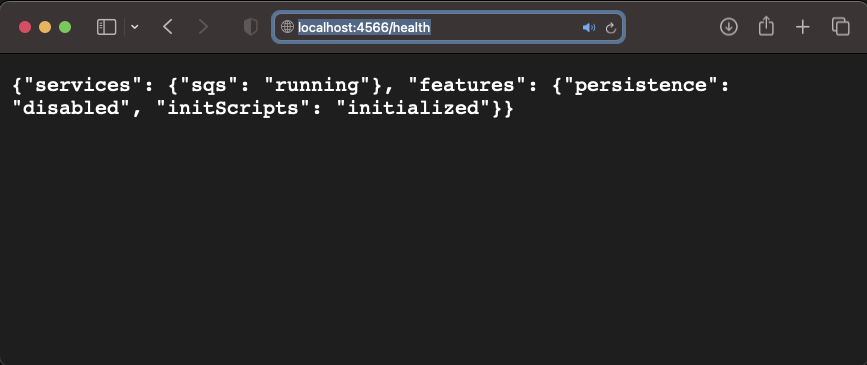

# &#x1F6A9; Localstack service SQS (Amazon Simple Queue Service) build with docker compose.

&nbsp;

**Reference :** 
<pre>
    create-queue
    https://docs.aws.amazon.com/cli/latest/reference/sqs/create-queue.html

    https://docs.aws.amazon.com/cli/latest/reference/sqs/set-queue-attributes.html

    https://docs.localstack.cloud/user-guide/aws/sqs/
</pre>

&nbsp;

<pre>
    ❯ touch localstack/localstack_home/create-queue.json

    ❯ vim localstack/localstack_home/create-queue.json
        {
        "RedrivePolicy": "{\"deadLetterTargetArn\":\"arn:aws:sqs:us-east-1:80398EXAMPLE:MyDeadLetterQueue\",\"maxReceiveCount\":\"1000\"}",
        "MessageRetentionPeriod": "259200"
        }
</pre>

### &#x1F530; Docker Compose.
<pre>
    ❯ ccat docker-compose.yml

            version: "3.7"
            
            services:
              localstack:
                container_name: "${LOCALSTACK_DOCKER_NAME-localstack_main}"
                image: localstack/localstack:0.12.14
                container_name: localstack_sqs
                network_mode: bridge
                environment:
                  - SERVICES=sqs
                ports:
                  - "127.0.0.1:4566:4566"
                  - "127.0.0.1:4571:4571"
                volumes:
                  - ./localstack/localstack_entrypoint:/docker-entrypoint-initaws.d
                  - ./localstack/localstack_home:/home/localstack
</pre>

&nbsp;

### &#x1F530; Run Commands in a Docker Container
<pre>
    ❯ docker-compose up

        [+] Running 1/0
        ⠿ Container localstack_sqs  Created                                                                                                                                         0.0s
        Attaching to localstack_sqs
        localstack_sqs  | Waiting for all LocalStack services to be ready
        localstack_sqs  | 2024-03-27 10:58:19,913 CRIT Supervisor is running as root.  Privileges were not dropped because no user is specified in the config file.  If you intend to run as root, you can set user=root in the config file to avoid this message.
        localstack_sqs  | 2024-03-27 10:58:19,923 INFO supervisord started with pid 31
        localstack_sqs  | 2024-03-27 10:58:20,943 INFO spawned: 'dashboard' with pid 49
        localstack_sqs  | 2024-03-27 10:58:20,954 INFO spawned: 'infra' with pid 51
        localstack_sqs  | 2024-03-27 10:58:21,022 INFO success: dashboard entered RUNNING state, process has stayed up for > than 0 seconds (startsecs)
        localstack_sqs  | 2024-03-27 10:58:21,023 INFO exited: dashboard (exit status 0; expected)
        localstack_sqs  | (. .venv/bin/activate; exec bin/localstack start --host)
        localstack_sqs  | 2024-03-27 10:58:22,028 INFO success: infra entered RUNNING state, process has stayed up for > than 1 seconds (startsecs)
        localstack_sqs  | Starting local dev environment. CTRL-C to quit.
        localstack_sqs  | Waiting for all LocalStack services to be ready
        localstack_sqs  | Waiting for all LocalStack services to be ready
        localstack_sqs  | Waiting for all LocalStack services to be ready
        localstack_sqs  | 
        localstack_sqs  | LocalStack version: 0.12.14
        localstack_sqs  | LocalStack build date: 2021-07-02
        localstack_sqs  | LocalStack build git hash: 8c006f12
        localstack_sqs  | 
        localstack_sqs  | 2024-03-27T10:58:41:INFO:localstack.utils.analytics.profiler: Execution of "load_plugin_from_path" took 741.58ms
        localstack_sqs  | 2024-03-27T10:58:41:INFO:localstack.utils.analytics.profiler: Execution of "load_plugins" took 743.15ms
        localstack_sqs  | Starting edge router (https port 4566)...
        localstack_sqs  | Starting mock SQS service on http port 4566 ...
        localstack_sqs  | 2024-03-27T10:58:42:INFO:localstack.multiserver: Starting multi API server process on port 55553
        localstack_sqs  | [2024-03-27 10:58:42 +0000] [55] [INFO] Running on https://0.0.0.0:4566 (CTRL + C to quit)
        localstack_sqs  | 2024-03-27T10:58:42:INFO:hypercorn.error: Running on https://0.0.0.0:4566 (CTRL + C to quit)
        localstack_sqs  | [2024-03-27 10:58:42 +0000] [55] [INFO] Running on http://0.0.0.0:55553 (CTRL + C to quit)
        localstack_sqs  | 2024-03-27T10:58:42:INFO:hypercorn.error: Running on http://0.0.0.0:55553 (CTRL + C to quit)
        localstack_sqs  | Waiting for all LocalStack services to be ready
        localstack_sqs  | Waiting for all LocalStack services to be ready
        localstack_sqs  | Waiting for all LocalStack services to be ready
        localstack_sqs  | Ready.
        localstack_sqs  | 2024-03-27T10:59:06:INFO:localstack.utils.analytics.profiler: Execution of "start_api_services" took 24444.08ms

</pre>

&nbsp;

Check health:

    

 

&nbsp;

Open with other terminals. 

<pre>
    ❯ docker images --format "{{.Repository}}\t{{.Tag}}\t{{.ID}}\t{{.CreatedAt}}\t{{.Size}}" | grep "localstack"
        localstack/localstack   0.12.14 e28c959c30fd    2021-07-03 03:24:38 +0700 WIB   754MB

    ❯ docker ps -a --format "table {{.ID}}\t{{.Image}}\t{{.Status}}\t{{.Names}}\t{{.Ports}}"
        CONTAINER ID   IMAGE                           STATUS          NAMES            PORTS
        46fa761e7514   localstack/localstack:0.12.14   Up 37 seconds   localstack_sqs   127.0.0.1:4566->4566/tcp, 5678/tcp, 127.0.0.1:4571->4571/tcp, 8080/tcp
</pre>

&nbsp;

Command into the container. 
<pre>
    ❯ docker exec -it localstack_sqs /bin/sh
</pre>
<pre>
        #########################################################################
        ❯ aws configure list
                Name                    Value             Type    Location
                ----                    -----             ----    --------
            profile                   <not set>             None    None
            access_key                <not set>             None    None
            secret_key                <not set>             None    None
                region                <not set>             None    None

        ❯ cat ~/.aws/credentials
            cat: can't open '/root/.aws/credentials': No such file or directory                

        ❯ aws configure set aws_access_key_id xyz
        ❯ aws configure set aws_secret_access_key aaa
        ❯ aws configure set default.region ap-southeast-3

        ❯ aws configure list
                Name                    Value             Type    Location
                ----                    -----             ----    --------
            profile                    <not set>             None    None
            access_key       ****************xyz  shared-credentials-file    
            secret_key       ****************aaa  shared-credentials-file    
                region            ap-southeast-3      config-file    ~/.aws/config
                

        ❯ cat ~/.aws/credentials
            [default]
            aws_access_key_id = xyz
            aws_secret_access_key = aaa
        #########################################################################
</pre>
**&#x2705; Example 1**: create-queue, list-queue, send-message, receive-message, delete-queue.
<pre>
        #########################################################################

        # Example 1 :

        ❯ awslocal sqs create-queue --queue-name submit_order
            {
                "QueueUrl": "http://localhost:4566/000000000000/submit_order"
            }        

        ❯ awslocal sqs list-queues --queue-name-prefix submit
            {
                "QueueUrls": [
                    "http://localhost:4566/000000000000/submit_order"
                ]
            } 
</pre>
<pre>
        ❯ awslocal sqs send-message --queue-url http://localhost:4566/000000000000/submit_order --message-body "Welcome to SQS queue by Dhony Abu Muhammad"
            {
                "MD5OfMessageBody": "7505439829c760b42b22a2c6a81a3746",
                "MessageId": "9ee99b4a-7204-8a83-e3c5-ae4617b45dcd"
            }        
</pre>
<pre>
        ❯ awslocal sqs receive-message --queue-url http://localhost:4566/000000000000/submit_order
            {
                "Messages": [
                    {
                        "MessageId": "9ee99b4a-7204-8a83-e3c5-ae4617b45dcd",
                        "ReceiptHandle": "qqemtvkidrwumgkpczckyrazordjtcjlqhsgexqsrjzfzhdfeujbuqeaydzsriwlnxufeuedqudaxyhscvqwprpwrqrmjcoptvcdtkdyoexslgoofcurefprsypvjuyjsyymxxzoohvdeiwtkcfmqolzuxkymnzewvmirdjtrzixpkbnzqzzydnbx",
                        "MD5OfBody": "7505439829c760b42b22a2c6a81a3746",
                        "Body": "Welcome to SQS queue by Dhony Abu Muhammad"
                    }
                ]
            }
</pre>
<pre>
        ❯ awslocal sqs delete-queue --queue-url http://localhost:4566/000000000000/submit_order
</pre>

Install jq (a lightweight and flexible command-line JSON processor). 
<pre>
        # Install jq
        ❯ apk update && apk add --no-cache jq

            fetch http://dl-cdn.alpinelinux.org/alpine/v3.11/main/x86_64/APKINDEX.tar.gz
            fetch http://dl-cdn.alpinelinux.org/alpine/v3.11/community/x86_64/APKINDEX.tar.gz
            v3.11.13-12-g2cfa91a2b4 [http://dl-cdn.alpinelinux.org/alpine/v3.11/main]
            v3.11.11-124-gf2729ece5a [http://dl-cdn.alpinelinux.org/alpine/v3.11/community]
            OK: 11307 distinct packages available
            fetch http://dl-cdn.alpinelinux.org/alpine/v3.11/main/x86_64/APKINDEX.tar.gz
            fetch http://dl-cdn.alpinelinux.org/alpine/v3.11/community/x86_64/APKINDEX.tar.gz
            (1/2) Installing oniguruma (6.9.4-r1)
            (2/2) Installing jq (1.6-r0)
            Executing busybox-1.31.1-r10.trigger
            OK: 377 MiB in 94 packages        

        ❯ jq --version

            jq-master-v20191114-85-g260888d269
</pre>
**&#x2705; Example 2**: create-queue, set-queue-attributes, receive-message max-number-of-messages, delete-message
<pre>
        # Example 2 :

        ❯ awslocal sqs create-queue --queue-name test-queue --attributes 
            "ReceiveMessageWaitTimeSeconds=1,
             VisibilityTimeout=20,
             RedrivePolicy.deadLetterTargetArn=$ARN,
             RedrivePolicy.maxReceiveCount=1"

                {
                    "QueueUrl": "http://localhost:4566/000000000000/test-queue"
                }
</pre>
<pre>        
        ❯ ls -lah /home/localstack/ | grep set-queue-attributes.json
            -rw-r--r--    1 root     root         166 Mar 28 02:04 set-queue-attributes.json

        # or set-attributes with a file
        ❯ awslocal sqs create-queue --queue-name test-queue
            {
                "QueueUrl": "http://localhost:4566/000000000000/test-queue"
            }        

        ❯ awslocal sqs set-queue-attributes --queue-url http://localhost:4566/000000000000/test-queue --attributes file:///home/localstack/set-queue-attributes.json
</pre>
<pre>
        # continue command
        ❯ awslocal sqs list-queues --queue-name-prefix test
            {
                "QueueUrls": [
                    "http://localhost:4566/000000000000/test-queue"
                ]
            }

        ❯ awslocal sqs get-queue-attributes --queue-url http://localhost:4566/000000000000/test-queue --attribute-names All | jq -r .
            {
                "Attributes": {
                    "ApproximateNumberOfMessages": "0",
                    "ApproximateNumberOfMessagesDelayed": "0",
                    "ApproximateNumberOfMessagesNotVisible": "0",
                    "CreatedTimestamp": "1711589035.023596",
                    "DelaySeconds": "0",
                    "LastModifiedTimestamp": "1711589035.023596",
                    "MaximumMessageSize": "262144",
                    "MessageRetentionPeriod": "345600",
                    "QueueArn": "arn:aws:sqs:us-east-1:000000000000:test-queue",
                    "ReceiveMessageWaitTimeSeconds": "1",
                    "VisibilityTimeout": "20"
                }
            }

        ❯ awslocal sqs list-queues
            {
                "QueueUrls": [
                    "http://localhost:4566/000000000000/test-queue"
                ]
            }
</pre>
<pre>
        ❯ awslocal sqs send-message --queue-url http://localhost:4566/000000000000/test-queue --message-body "Welcome to SQS queue by Dhony Abu Muhammad"
            {
                "MD5OfMessageBody": "7505439829c760b42b22a2c6a81a3746",
                "MessageId": "65f8de23-6a08-8270-99dd-f9edd79a79e6"
            }        

        ❯ awslocal sqs send-message --queue-url http://localhost:4566/000000000000/test-queue --message-body "BMKG | Mag:3.7, 28-Mar-2024 04:03:03WIB, Lok:5.83LS, 112.35BT (123 km TimurLaut TUBAN-JATIM), Kedlmn:10 Km"
            {
                "MD5OfMessageBody": "bb433e30faecdbee39f3ba4a2789a928",
                "MessageId": "d9b80a7b-f5d4-11b5-efad-90977eaf465d"
            }
</pre>
<pre>
        ❯ awslocal sqs receive-message --queue-url http://localhost:4566/000000000000/test-queue --max-number-of-messages 2
            {
                "Messages": [
                    {
                        "MessageId": "65f8de23-6a08-8270-99dd-f9edd79a79e6",
                        "ReceiptHandle": "dywtavvbecbzeoxmxbueqdjwqkzqmnpnommlzbemmzeijrllxawvuhwipgfznqchhmphfvfffyaotilodzumusuqthyhsylggieatqoradulyjtctxipsifwvmrinewebcmvdczwkgnnwikacelqgqumlzgvksdwsxabddijhrnsngdhqmgtxoveh",
                        "MD5OfBody": "7505439829c760b42b22a2c6a81a3746",
                        "Body": "Welcome to SQS queue by Dhony Abu Muhammad"
                    },
                    {
                        "MessageId": "d9b80a7b-f5d4-11b5-efad-90977eaf465d",
                        "ReceiptHandle": "thvdctvafgiddozmaywtsjcbzshejzxipnjoygtxvssasyaisbnywaeezbjguoezpvjkztvmfvtukaebihczuqdvgmtkponvelqrjbfjcsorihafegmazrnbcrprxzojhihujtstrktejshorftlvfrytoesvqeqoqlotxhbtngvwalnwmnrxfaff",
                        "MD5OfBody": "bb433e30faecdbee39f3ba4a2789a928",
                        "Body": "BMKG | Mag:3.7, 28-Mar-2024 04:03:03WIB, Lok:5.83LS, 112.35BT (123 km TimurLaut TUBAN-JATIM), Kedlmn:10 Km"
                    }
                ]
            }
</pre>
Delete a message from the queue. 
<pre>
        # awslocal sqs delete-message --queue-url http://localhost:4566/000000000000/test-queue --receipt-handle &lt;receipt-handle&gt;
        ❯ awslocal sqs delete-message --queue-url http://localhost:4566/000000000000/test-queue --receipt-handle "kaiqacmyglqkcccdtqjfygtbcxhhndpmqnvrgdnrrjtueaigbhkcjgarcvncynjljryskepvvhcumbhqxhyuehqowhthjpawsfmtrjabztzssxnecukxudffouqpfnyknsgzitgtgskcmsogcjwxirysbgpuuzkhbispupqpwwfsndrpvcilprzkf"
</pre>
<pre>
        ❯ awslocal sqs receive-message --queue-url http://localhost:4566/000000000000/test-queue --max-number-of-messages 2
        {
            "Messages": [
                {
                    "MessageId": "d9b80a7b-f5d4-11b5-efad-90977eaf465d",
                    "ReceiptHandle": "forhotuvzhddrutxywausgtycpqhazeckvcwgifjdkuywegpwktpyvxcpobtakuhkvmmuyekchkpkbkdnqscykrterkgqmhrfuwhzfjupgvffzjvihjhynbkrihxctbossceppbyuxrogdhengaqkcjpqoliflgzmgkdysqrfcurnrgnyzynfaibe",
                    "MD5OfBody": "bb433e30faecdbee39f3ba4a2789a928",
                    "Body": "BMKG | Mag:3.7, 28-Mar-2024 04:03:03WIB, Lok:5.83LS, 112.35BT (123 km TimurLaut TUBAN-JATIM), Kedlmn:10 Km"
                }
            ]
        }
</pre>
Command to purge the queue. 
<pre>
        ❯ awslocal sqs delete-queue --queue-url http://localhost:4566/000000000000/test-queue
        #########################################################################

        ❯ exit
</pre>

&nbsp;

### &#x1F530; command used outside the container:

<pre>
❯ aws --endpoint-url=http://localhost:4566 sqs list-queues --queue-name-prefix submit
    {
        "QueueUrls": [
            "http://localhost:4566/000000000000/submit_order"
        ]
    } 

❯ aws --endpoint-url=http://localhost:4566 sqs send-message --queue-url http://localhost:4566/000000000000/submit_order --message-body "Welcome to SQS queue by Dhony Abu Muhammad"
    {
        "MD5OfMessageBody": "7505439829c760b42b22a2c6a81a3746",
        "MessageId": "6483c5e2-71ce-1845-de5d-6dd7aa41807a"
    }

❯ aws --endpoint-url=http://localhost:4566 sqs receive-message --queue-url http://localhost:4566/000000000000/submit_order
    {
        "Messages": [
            {
                "MessageId": "9ee99b4a-7204-8a83-e3c5-ae4617b45dcd",
                "ReceiptHandle": "kevpbdhhkwpmaptwjvzktnbszkhluxxbrvcsvqzdruofmapwvocjybtzaorqmulumewwiaprsxgawbcqkqdlvhoctspfdqyncqwtizbzmsrfwrthrvcwxgsspgbkmletyfvufcgexukptirfussliwpmsrkjpssujkvzfzzycryxhqkfrexhgxtvo",
                "MD5OfBody": "7505439829c760b42b22a2c6a81a3746",
                "Body": "Welcome to SQS queue by Dhony Abu Muhammad"
            }
        ]
    }
</pre>

&nbsp;

### &#x1F530; Bring back to the command interpreter

<pre>
     ❯ docker restart localstack_sqs

     ❯ docker logs localstack_sqs
 
     ❯ docker exec -it localstack_sqs /bin/sh
</pre>

### &#x1F530; Command once more in the container's interactive shell

<pre>
        #########################################################################
        ❯ aws configure list
                Name                    Value             Type    Location
                ----                    -----             ----    --------
            profile                  <not set>             None    None
            access_key      ****************xyz shared-credentials-file    
            secret_key      ****************aaa shared-credentials-file    
                region           ap-southeast-3      config-file    ~/.aws/config     

        #########################################################################
</pre>